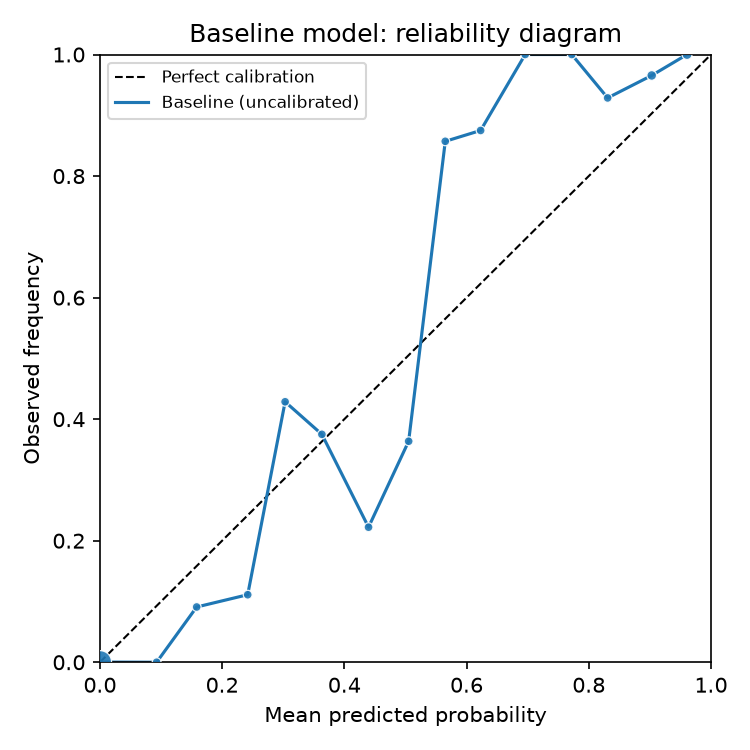
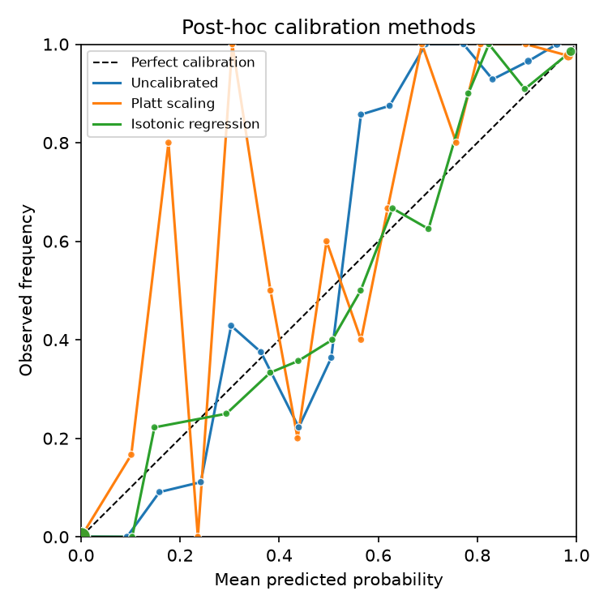
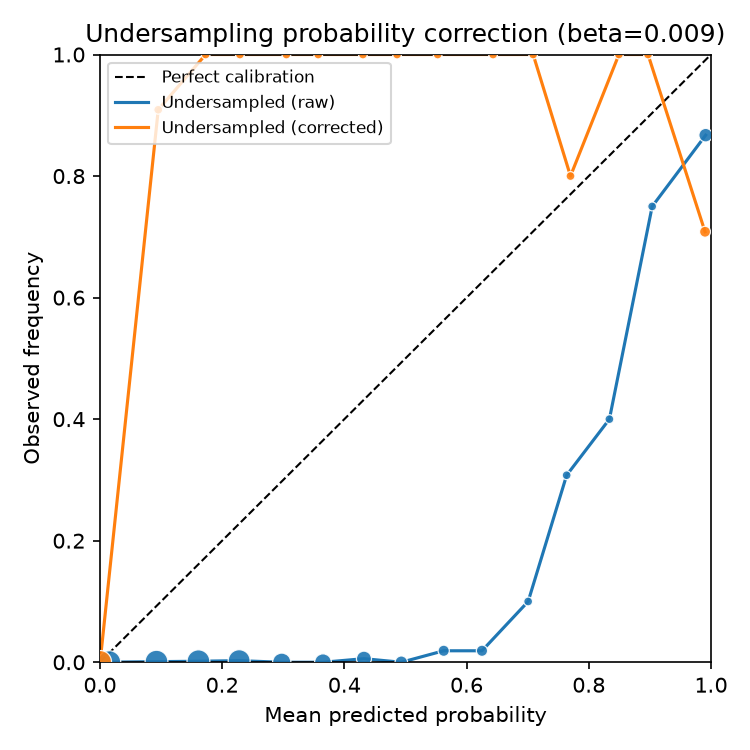
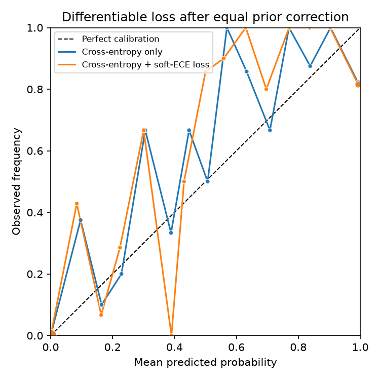

# Exploring Probability Calibration in Imbalanced Fraud Detection

This is a small learning project I built while trying to understand
**probability calibration in imbalanced classification**. I use credit-card
fraud detection because it is close to my current work on health-insurance
fraud, while still relying on a public dataset.

The question behind the repository is simple: if a model ranks fraud cases
well, can its score really be read as a probability? I first tried standard
post-hoc calibration, then reproduced the prior correction needed after
undersampling, and finally implemented a simple differentiable soft-ECE loss.
The last part is exploratory. It is not proposed as a new method, and the
results show trade-offs rather than a clean win.

I kept the code in separate files so that I could test each part, but the
whole experiment still runs from one script. My decisions and unsuccessful
attempts are recorded in [EXPERIMENT_NOTES.md](EXPERIMENT_NOTES.md).

The project builds up in four steps:

1. **Diagnose** the problem: train a standard classifier and assess
   discrimination separately from calibration (reliability diagram, Expected
   Calibration Error, adaptive ECE, and a top-1% calibration gap focused on
   the high-score region where investigation decisions actually happen).
2. **Fix it after training**, with the two classic post-hoc methods: Platt
   scaling and isotonic regression.
3. **Fix a specific, well-known failure mode**: training on an
   undersampled, artificially rebalanced dataset shifts predicted
   probabilities away from the true class prior. This is corrected with the
   closed-form prior-correction formula from Dal Pozzolo, Caelen, Johnson &
   Bontempi (2015).
4. **Fix it during training instead**: a small PyTorch classifier is
   trained with an added *differentiable* soft-ECE loss, jointly with the
   usual cross-entropy loss, and compared to a plain cross-entropy baseline.
   Because both networks are trained on the same undersampled data, the same
   analytical prior correction is applied to both before evaluation on the
   original population. This keeps the comparison focused on the training
   objective rather than on an avoidable prior-probability shift.

## Dataset

[Credit Card Fraud Detection](https://www.kaggle.com/datasets/mlg-ulb/creditcardfraud)
(Worldline / ULB Machine Learning Group): 284,807 European card transactions
over two days, 492 of which are fraudulent (0.172%). Features `V1`-`V28` are
the result of a PCA transformation applied to the original (undisclosed)
attributes for confidentiality; `Time` and `Amount` are kept as-is.

The raw CSV is not included in this repository (file size and licensing).
`src/data.py` will, in order:

1. look for a local copy at `data/creditcard.csv` (download it from Kaggle
   and place it there for the exact canonical file), then
2. fall back to fetching the same dataset from
   [OpenML](https://www.openml.org/search?type=data&id=1597) (`data_id=1597`),
   which requires no account or API key, then
3. fall back to a synthetic dataset with a matching imbalance ratio, so the
   pipeline always runs end to end even without internet access.

Results in `results/` were produced with the real dataset (see the data
source noted at the top of `results/summary.md`).

## What I implemented

- **Baseline model**: a `RandomForestClassifier`, trained without any
  class-balancing, on purpose — it is a good example of a model that
  discriminates well but is not a probability estimator out of the box.
- **Calibration metrics**: no single binned metric is treated as definitive.
  The pipeline reports log loss, Brier score, equal-width ECE, equal-mass
  adaptive ECE (ACE), and an operational *top-1% calibration gap*. In an
  imbalanced setting, global ECE is dominated by low-score genuine
  transactions and can look small even when the highest scores that drive
  investigation are unreliable. Reporting several views also makes binning
  sensitivity visible rather than hiding it.
- **Undersampling correction**: `correct_undersampled_probabilities` in
  `src/calibrate.py` implements the closed-form correction for training on
  an undersampled majority class (Elkan, 2001; used for fraud detection in
  Dal Pozzolo, Caelen, Johnson & Bontempi, 2015).
- **Experimental differentiable calibration loss**: `soft_ece_loss` in
  `src/differentiable_calibration.py` is a soft-binned relaxation of ECE —
  each example gets a smooth, Gaussian-kernel membership across probability
  bins instead of being hard-assigned to one, so the objective is
  differentiable and can be minimised jointly with cross-entropy. This is a
  simplified, from-scratch version of ideas from the differentiable /
  trainable calibration literature (e.g. Kumar et al., 2018; Karandikar et
  al., 2021). My implementation is only a binary illustration and should not
  be read as a reproduction of either paper.

## Results

All numbers below are from a real run on the full 284,807-transaction
dataset (see `results/summary.md`, regenerated by `run_pipeline.py`).
Ranking discrimination, especially AUC-ROC, stays broadly similar across
several methods, while calibration metrics respond very differently depending
on what caused the miscalibration in the first place. AUC-PR also shows that
seemingly similar ROC performance can hide meaningful rare-class differences.

| Method | AUC-ROC | AUC-PR | Log loss | Brier | ECE | ACE | Top-1% CE |
|---|---|---|---|---|---|---|---|
| Baseline (uncalibrated) | 0.9704 | 0.8089 | 0.00333 | 0.00051 | 0.00030 | 0.00025 | 0.00360 |
| Platt scaling | 0.9716 | 0.8065 | 0.00356 | 0.00053 | 0.00016 | 0.00048 | 0.01609 |
| Isotonic regression | 0.9696 | 0.8051 | 0.00321 | 0.00050 | 0.00015 | 0.00019 | 0.00411 |
| Undersampled (raw) | 0.9701 | 0.6425 | 0.03898 | 0.00461 | 0.03050 | 0.03050 | 0.38708 |
| Undersampled (Elkan-corrected) | 0.9701 | 0.6425 | 0.00780 | 0.00095 | 0.00075 | 0.00050 | 0.04041 |
| MLP, cross-entropy only* | 0.9705 | 0.6866 | 0.00486 | 0.00070 | 0.00043 | 0.00010 | 0.00520 |
| MLP, cross-entropy + soft-ECE* | 0.9688 | 0.6901 | 0.00485 | 0.00069 | 0.00050 | 0.00015 | 0.00139 |

\*Both MLP outputs receive the same analytical correction for the training
undersampling prior before these metrics are computed.

A few things worth noting rather than glossing over:

- The untouched baseline is already fairly well calibrated on average here
  (a Random Forest's predicted probabilities are themselves bagged empirical
  frequencies) -- the textbook "accurate but overconfident" failure is not
  automatic; it depends on the model and how it was trained. **Naive
  undersampling is where the real damage happens**: both ECE and the top-1%
  calibration gap increase by roughly two orders of magnitude. The analytical
  correction removes most, though not all, of that error.
- Platt scaling actually *increases* the top-1% calibration gap here even
  though it improves overall ECE -- its parametric sigmoid shape does not
  fit this particular tail well, while the non-parametric isotonic
  regression improves both. A reminder that "apply a calibration method"
  is not a single well-defined fix.
- After controlling for the sampling prior, the differentiable loss produces
  a clear improvement in the top-1% calibration gap (0.00520 to 0.00139) and
  tiny improvements in log loss and Brier score. It does **not** improve every
  metric: equal-width ECE and ACE become slightly worse, while AUC-ROC falls
  modestly. This metric-dependent trade-off is more informative than claiming
  a universal calibration gain. Higher loss weights also made discrimination
  collapse in preliminary runs, illustrating the near-constant-prediction
  shortcut available to poorly balanced calibration objectives. Designing an
  objective that behaves robustly, especially in the multiclass case, is the
  open problem this repository deliberately stops short of solving.

### Baseline: good discrimination, already-tight calibration



### Post-hoc calibration: Platt scaling vs. isotonic regression



### Undersampling breaks calibration; the Elkan/Dal Pozzolo-Caelen correction fixes it



### My soft-ECE experiment, trained jointly with cross-entropy



## Running it

```bash
pip install -r requirements.txt
python run_pipeline.py
```

Run the unit tests with only the Python standard-library test runner:

```bash
python -m unittest discover -s tests -v
```

Optional: download `creditcard.csv` from Kaggle and place it in `data/` to
run on a local copy instead of fetching from OpenML.

## Current limitations

- The main experiment uses a single train/test split and a single random seed.
  Repeated runs would be needed before drawing strong conclusions.
- The soft-ECE weight (`0.5`) is an exploratory choice, not the result of a
  formal hyperparameter search.
- Binned calibration metrics depend on the binning rule. This is why I report
  both equal-width ECE and equal-mass ACE, but neither is a ground truth.
- The neural-network experiment is binary, whereas the PhD topic that
  motivated this work is multiclass.
- The analytical prior correction assumes random majority-class
  undersampling. It does not automatically apply to every resampling scheme
  or to general dataset shift.
- I have not yet added repeated-seed uncertainty intervals or multiclass
  classwise calibration diagnostics. These are the next logical extensions.

## References

- Dal Pozzolo, A., Caelen, O., Johnson, R. A., & Bontempi, G. (2015).
  *Calibrating Probability with Undersampling for Unbalanced
  Classification.* IEEE Symposium Series on Computational Intelligence.
- Guilbert, T., Caelen, O., Chirita, A., & Saerens, M. (2024). *Calibration
  methods in imbalanced binary classification.* Annals of Mathematics and
  Artificial Intelligence, 92(5), 1319-1352.
- Elkan, C. (2001). *The Foundations of Cost-Sensitive Learning.* IJCAI.
- Kumar, A., Sarawagi, S., & Jain, U. (2018). *Trainable Calibration
  Measures for Neural Networks from Kernel Mean Embeddings.* ICML.
- Karandikar, A., et al. (2021). *Soft Calibration Objectives for Neural
  Networks.* NeurIPS.

## License

MIT (see [LICENSE](LICENSE)).
